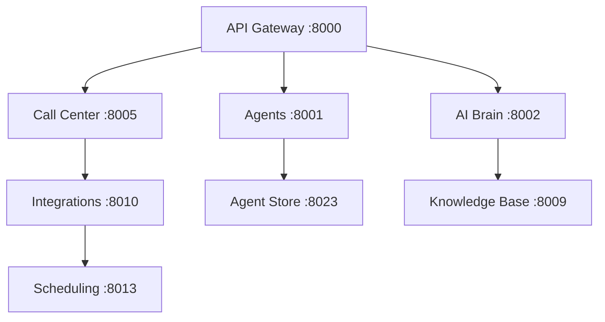

# 🚀 Deploy All 25 Services to Railway

## Current Status
✅ **Overview Service**: Already deployed and running
🎯 **Target**: Deploy remaining 24 services

## 📋 Deployment Checklist

### Phase 1: Core Services (Priority)
- [ ] **API Gateway** (Port 8000) - Main entry point
- [ ] **Agents** (Port 8001) - Agent management
- [ ] **AI Brain** (Port 8002) - Core AI processing
- [ ] **Call Center** (Port 8005) - Call operations
- [ ] **Integrations** (Port 8010) - Calendar sync

### Phase 2: Business Services
- [ ] **Analytics Pro** (Port 8003) - Advanced analytics
- [ ] **Billing Pro** (Port 8004) - Billing system
- [ ] **Compliance** (Port 8006) - Regulatory compliance
- [ ] **Flow Builder** (Port 8007) - Conversation flows
- [ ] **Developer API** (Port 8008) - API management
- [ ] **Knowledge Base** (Port 8009) - Knowledge system
- [ ] **Lead Management** (Port 8011) - Lead tracking
- [ ] **Notifications** (Port 8012) - Alert system
- [ ] **Scheduling** (Port 8013) - Appointment booking
- [ ] **Phone Numbers** (Port 8014) - Number management

### Phase 3: Advanced Services
- [ ] **Scripts** (Port 8015) - Conversation scripts
- [ ] **Smart Campaigns** (Port 8016) - Marketing automation
- [ ] **Settings** (Port 8017) - Configuration management
- [ ] **Team Hub** (Port 8018) - Team collaboration
- [ ] **Voice Lab** (Port 8019) - Voice processing
- [ ] **Voice Marketplace** (Port 8021) - Voice marketplace
- [ ] **White Label** (Port 8022) - Multi-tenant branding
- [ ] **Agent Store** (Port 8023) - AI agent marketplace
- [ ] **Webhooks** (Port 8024) - Event notifications

## 🚂 Railway Deployment Steps

### Method 1: Railway Dashboard (Recommended)

1. **Go to Railway Dashboard**: https://railway.app/dashboard
2. **For each service**:
   - Click "New Service"
   - Choose "GitHub Repo"
   - Select `vocelioai/vocelio-ai-backend`
   - Set root directory to `apps/[service-name]`
   - Configure environment variables
   - Deploy

### Method 2: Railway CLI

```bash
# Install Railway CLI
npm install -g @railway/cli

# Login
railway login

# For each service:
railway service create api-gateway
railway service create agents
railway service create ai-brain
# ... etc for all services

# Deploy each service
railway up --service api-gateway
railway up --service agents
railway up --service ai-brain
# ... etc
```

## 🔧 Environment Variables for Each Service

### Global Variables (All Services)
```bash
PORT=8XXX                    # Specific to each service
ENVIRONMENT=production
DEBUG=false
LOG_LEVEL=info
DATABASE_URL=postgresql://...
REDIS_URL=redis://...
```

### Service-Specific Variables

**API Gateway (8000)**:
```bash
PORT=8000
SERVICE_NAME=api-gateway
RATE_LIMIT_REQUESTS=1000
```

**Agents (8001)**:
```bash
PORT=8001
SERVICE_NAME=agents
MAX_AGENTS=100
```

**AI Brain (8002)**:
```bash
PORT=8002
SERVICE_NAME=ai-brain
OPENAI_API_KEY=your-key
MODEL_NAME=gpt-4
```

**Call Center (8005)**:
```bash
PORT=8005
SERVICE_NAME=call-center
TWILIO_ACCOUNT_SID=your-sid
TWILIO_AUTH_TOKEN=your-token
```

**Integrations (8010)**:
```bash
PORT=8010
SERVICE_NAME=integrations
GOOGLE_CALENDAR_CREDENTIALS=path/to/creds
OUTLOOK_CLIENT_ID=your-id
```

## 📊 Service Dependencies



## 🔄 Deployment Order

1. **API Gateway** - Must be first (entry point)
2. **Core Services** - Agents, AI Brain, Call Center
3. **Integration Services** - Integrations, Scheduling
4. **Business Services** - All remaining services
5. **Test connectivity** between services

## 🧪 Post-Deployment Testing

### Health Check All Services
```bash
# Test each service health endpoint
curl https://api-gateway-production.railway.app/health
curl https://agents-production.railway.app/health
curl https://ai-brain-production.railway.app/health
# ... etc for all services
```

### Service Communication Test
```bash
# Test inter-service communication
curl https://api-gateway-production.railway.app/api/agents
curl https://scheduling-production.railway.app/calendar/providers
```

## 🚨 Troubleshooting

### Common Issues:
1. **Port conflicts**: Ensure each service uses correct PORT env var
2. **Service discovery**: Update service URLs in environment variables
3. **Health checks failing**: Verify `/health` endpoints respond
4. **Memory limits**: Monitor Railway resource usage

### Resource Monitoring:
- **Memory**: ~512MB per service (adjust as needed)
- **CPU**: Railway auto-scales based on load
- **Network**: Internal communication is free

## 💰 Cost Estimation

**Railway Pricing**:
- **Hobby Plan**: $5/month + $0.000463/GB-hour
- **Pro Plan**: $20/month + usage
- **Estimated for 25 services**: ~$50-100/month

## 🎯 Success Metrics

- [ ] All 25 services deployed successfully
- [ ] All health checks returning 200 OK
- [ ] Inter-service communication working
- [ ] Calendar integration functional
- [ ] API Gateway routing correctly
- [ ] No memory/CPU alerts
- [ ] Response times < 500ms

---

🚀 **Ready to deploy all 25 services?** Follow this guide step by step!
